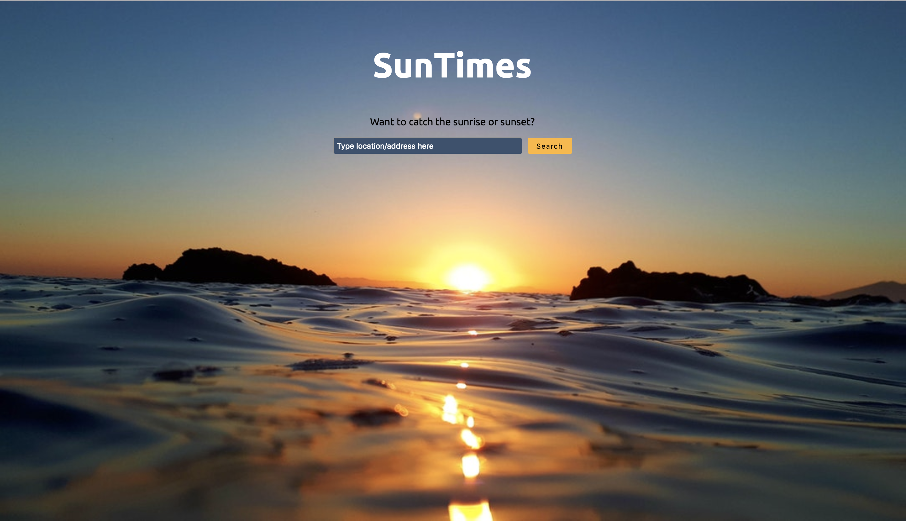
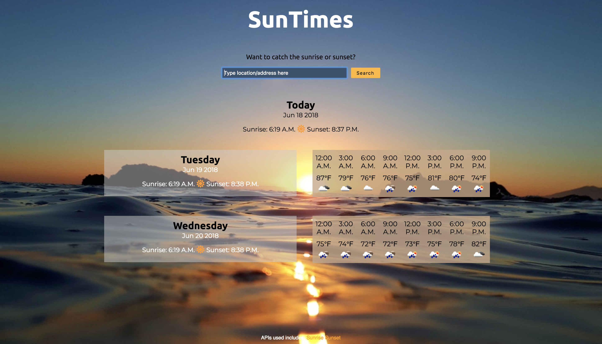

<h1>SunTimes</h1>

Check it out [here](https://maripal.github.io/api-capstone-suntimes/)

<h2>Screenshots</h2>

This is the landing page - 

This is the page w/ your search results - 

<h2>About SunTimes</h2>

This is app is for those who might want to catch the sunrsise or sunset. 
You type in your location, and it returns the sunrise/sunset times only for the current day. 
It also returns times and weather for the next two days.

<h2>Technology Used</h2>

<ul>
<li>HTML</li>
<li>CSS</li>
<li>JavaScript</li>
<li>Jquery</li>
</ul>